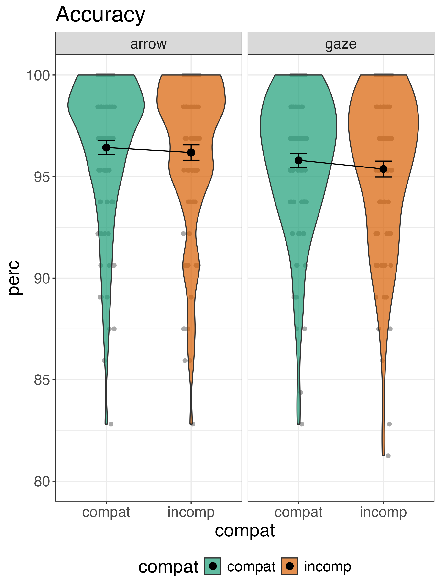
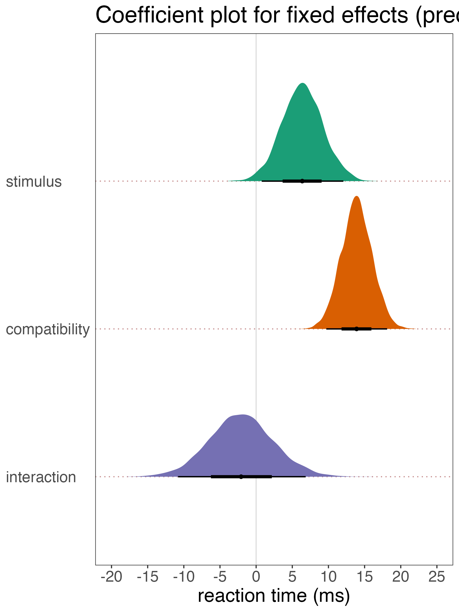

```{r setup, include = FALSE}
pkg <- c("papaja", "citr", "tidyverse", "RColorBrewer", "patchwork")

lapply(pkg, library, character.only = TRUE)

r_refs(file = "r-references.bib")
my_r_citation <- cite_r(file = "r-references.bib")
```

```{r analysis-preferences}
# Seed for random number generation
set.seed(42)
knitr::opts_chunk$set(cache.extra = knitr::rand_seed)
```

```{r plot-settings}
## theme settings for ggplot
theme_set(
  theme_bw() +
    theme(text = element_text(size = 18), 
          title = element_text(size = 18),
          legend.position = "bottom")
)

## Set the amount of dodge in figures
pd <- position_dodge(0.7)
pd2 <- position_dodge(1)
```

```{r global-chunk-settings}
## set the figure options
knitr::opts_chunk$set(fig.pos='H', out.extra = '', out.height = "67%",
                      fig.align = "center") # initial version
```

# Introduction

# Methods
We report how we determined our sample size, all data exclusions (if any), all manipulations, and all measures in the study [@simmons2012]. 

## Participants

## Material

## Procedure

## Data analysis
We used `r my_r_citation` for all our analyses.


# Results

## Descriptive statistics ##

Raw data plots

Accuracy by condition violin plot

(ref:accuracy-caption) Accuracy is quite high for both types of stimuli

```{r accuracy-plot, fig.cap = "(ref:accuracy-caption)"}

```

Reaction time by condition violin plot

(ref:rt-violin-caption) RT as a function of stimuli and conditions.

```{r rt-violin-plot, fig.cap = "(ref:rt-violin-caption)"}

```

Reaction time by difference scores violin plot 

(ref:rt-diff-caption) RT difference scores (incomp - compat) by stimulus type.

```{r rt-diff-plot, fig.cap = "(ref:rt-diff-caption)"}

```

Reaction time by difference scores density plot with quantiles 

(ref:rt-dens-caption) RT difference scores (incomp - compat) as a density plot.

```{r diff-dens-plot, fig.cap = "(ref:rt-dens-caption)"}

```

## Inferential statistics ##

Now we plot and tabulate parameters from the posterior distribution.

Fixed effects from model b2

(ref:fixed-fig-caption) Fixed effects from model b2.

```{r fixef-plot, fig.cap = "(ref:fixed-fig-caption)"}

```

(ref:fixef-table-caption) Fixed effects from model b2.

(ref:fixef-note-caption) Median point estimates and 95% quantile intervals shown.

```{r fixed-table}
fix_tab <- read_csv("../exp1/tables/b2_fix_tab.csv")

apa_table(
  fix_tab,
  caption = "(ref:fixef-table-caption)",
  note = "(ref:fixef-note-caption)",
  placement = "H"
)
```

# Discussion


\newpage

# References

::: {#refs custom-style="Bibliography"}
:::
