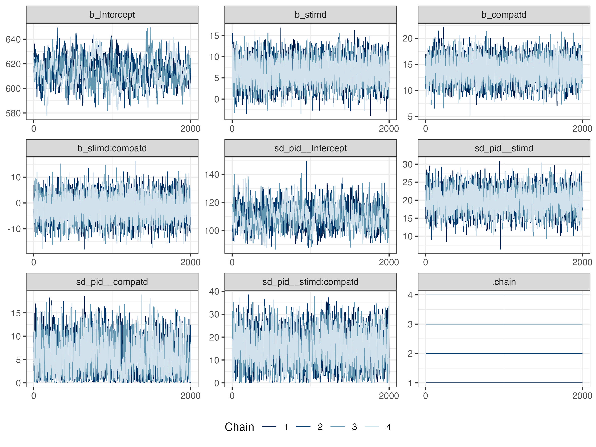

```{r setup, include = FALSE}
pkg <- c("papaja", "citr", "tidyverse", "RColorBrewer", "patchwork")

lapply(pkg, library, character.only = TRUE)
```

```{r plot-settings}
## theme settings for ggplot
theme_set(
  theme_bw() +
    theme(text = element_text(size = 18, face = "bold"), 
          title = element_text(size = 18, face = "bold"),
          legend.position = "bottom")
)

## Set the amount of dodge in figures
pd <- position_dodge(0.7)
pd2 <- position_dodge(1)
```

```{r global-chunk-settings}
## set the figure options
knitr::opts_chunk$set(fig.pos='H', out.extra = '', out.height = "67%",
                      fig.align = "center") # initial version
```

<!-- the below two lines directly change the default Figure and Table naming to Supplementary -->

<!-- see here for more details - https://stackoverflow.com/questions/47173279/internationalization-r-knitr-figure-caption-label -->

\renewcommand{\figurename}{Supplementary Figure}
\renewcommand{\tablename}{Supplemetentary Table}

# Supplementary Materials #

## Model formulas ##

The regression formula for the full model (model b2):
$$rt \sim 1 + stimulus * compatibility + \\
(1 + stimulus * compatibility | pid)$$

*Note:* rt = reaction time (ms); stimulus = blah; compatibility = blah; pid = subject/participant identifier.


## A supplementary table ##

Here, I just reproduce the table from the main manuscript to save time making anything else.
But of course in a real paper, you wouldn't do this, you'd just show whatever you needed.
It is labelled differentlyto reflect that it is a supplementary table.

(ref:supp-table-caption) Fixed effects from model b2.

(ref:supp-note-caption) Median point estimates and 95% quantile intervals shown.

```{r fixed-table}
fix_tab <- read_csv("../../exp1/tables/b2_fix_tab.csv")

apa_table(
  fix_tab,
  caption = "(ref:supp-table-caption)",
  note = "(ref:supp-note-caption)",
  placement = "H"
)
```

## A supplementary figure ##

Let's take a look at the mixing of chains in the model.
This is a useful model diagnostic check to see that the model built ok.

(ref:supp-figure-caption) Caterpillar plots showing the mixing of chains across parameters in model b2.

```{r supp-figure-plot, fig.cap = "(ref:supp-figure-caption)"}

```